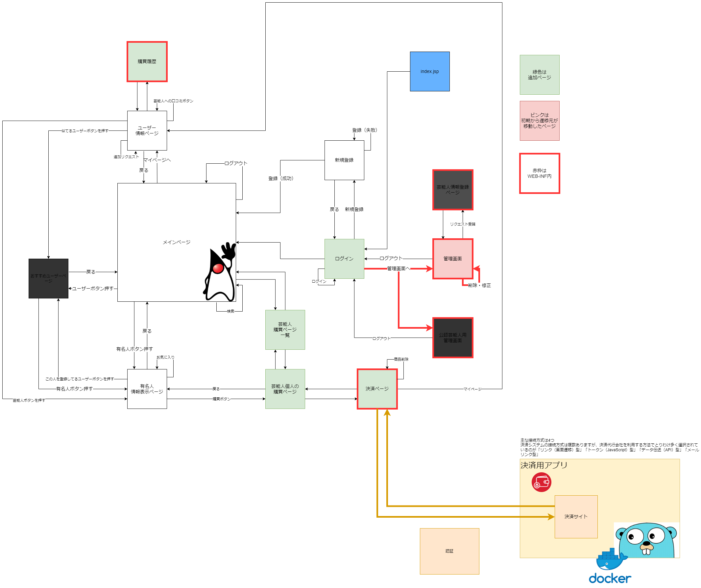
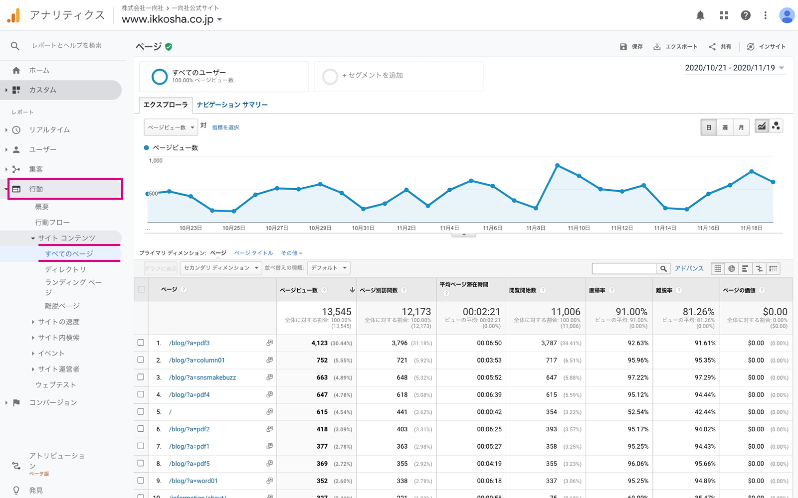

### 初期構想

- 画面遷移図



### 今出来ている事
- ページ作成
- ページ間遷移
- 遷移時に表示される内容変更
- ・タレント（個人、購買）
- ・ユーザー（ユーザー別、他人）
- wallet（決済）

### 出来ていないけど金曜までに終わらせる事
- なんかいろいろ表示増やす
- jsで表示整える
- 各画面のボタンを画像選択して遷移にする
- ユーザーページから追加リクエスト機能
- 運営用管理画面の中身（コメント・タレント・ユーザー情報の削除・修正）
- ユーザー新規登録ページの中身（既存タレントと新規タレントが混じってる場合が想定してたけど想定外だった）
- タレント追加ページの中身
- ログインページから新規登録
- 資料作り（スケジュール、仕様書、企画書、etc）


- データベースのdateとjavaのdate＞＞今は全部null登録

```java
java.sql.Date

import java.sql.Date;
	Date sqlNow = new Date(System.currentTimeMillis());
    //java.util.Dateから派生
	java.util.Date utilDate = sqlNow;
	Date sqlDate = new Date(utilDate.getTime());
```

- メイン画面のタレント並び替え
```java
Collections.sort(
    foo,
    new Comparator<Integer>() {
        @Override
        public int compare(Integer obj1, Integer obj2) {
            return obj2 - obj1;
        }
    }
);
```
### まだ諦めてない事
マイページにwalletの残高表示
コメント
購入情報を他人とリンク＞＞○○さんが○○を購入しました。
管理画面に商品別KPIダッシュボード（グラフ）
- kpi



walletで残高追加機能


### 完全に諦めた事

```java
HttpClientクラス - リクエストの送信やレスポンスの取得を行う
HttpRequestクラス - URIを含むリクエストの詳細情報をカプセル化する
HttpResponseインタフェース - サーバから受け取ったレスポンスをカプセル化する
```
まだイケるか？

### トラブル
model-view-controllerで分担は無理ゲー。
画面ごとに担当すれば良かった。

### wallet
pythonの学習が始まる前に別の言語を勉強するという事に興味がわいた。
